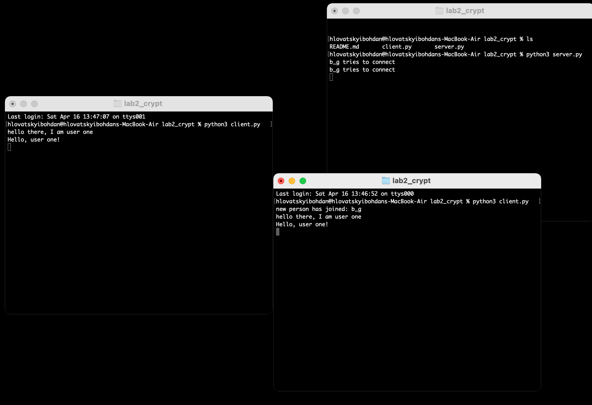

## Usage example

## Module:
1. [client.py] (#func3)
2. [server.py] (#func2)
3. [rsa_algorithm.py] (#func1)

### 1. CLIENT - client.py

### 2. SERVER - server.py

### 3. RSA - rsa_algorithm.py
functions:
 - set_dictionary

    ...
 - text_into_blocks

    ...
 - blocks_into_text

    ...
 - encrypt_rsa

    ...
 - decrypt_rsa

    ...

